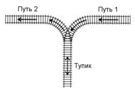

# Первая половина тем

- [A. Простая сортировка](#a-------------------)
  * [Условие](#-------)
  * [Входные данные](#--------------)
  * [Выходные данные](#---------------)
  * [Примеры](#-------)
- [B. Сортировка подсчетом](#b---------------------)
  * [Условие](#--------1)
  * [Входные данные](#---------------1)
  * [Выходные данные](#----------------1)
  * [Примеры](#--------1)
- [C. Количество инверсий](#c--------------------)
  * [Условие](#--------2)
  * [Входные данные](#---------------2)
  * [Выходные данные](#----------------2)
  * [Примеры](#--------2)
- [D. Печать вслепую](#d---------------)
  * [Условие](#--------3)
  * [Протокол взаимодействия](#-----------------------)
  * [Система оценки](#--------------)
  * [Примеры](#--------3)
    + [Примечание](#----------)
- [E. Хип ли?](#e--------)
  * [Условие](#--------4)
  * [Входные данные](#---------------3)
  * [Выходные данные](#----------------3)
  * [Примеры](#--------4)
- [F. Хипуй!](#f-------)
  * [Условие](#--------5)
  * [Входные данные](#---------------4)
  * [Выходные данные](#----------------4)
  * [Примеры](#--------5)
- [G. Префиксные суммы](#g-----------------)
  * [Условие](#--------6)
  * [Входные данные](#---------------5)
  * [Выходные данные](#----------------5)
  * [Примеры](#--------6)
- [H. Скобки](#h-------)
  * [Условие](#--------7)
  * [Входные данные](#---------------6)
  * [Выходные данные](#----------------6)
  * [Примеры](#--------7)
    + [Примечание](#-----------1)
- [I. Сортировка вагонов](#i-------------------)
  * [Условие](#--------8)
  * [Входные данные](#---------------7)
  * [Выходные данные](#----------------7)
  * [Примеры](#--------8)
- [J. Обход файлов](#j-------------)
  * [Условие](#--------9)
  * [Входные данные](#---------------8)
  * [Выходные данные](#----------------8)
  * [Примеры](#--------9)
- [K. Минимум в очереди](#k------------------)
  * [Условие](#--------10)
  * [Входные данные](#---------------9)
  * [Выходные данные](#----------------9)
  * [Примеры](#--------10)
- [L. Быстрый поиск в массиве](#l------------------------)
  * [Условие](#--------11)
  * [Входные данные](#---------------10)
  * [Выходные данные](#----------------10)
  * [Примеры](#--------11)
- [M. Приближенный двоичный поиск](#m----------------------------)
  * [Условие](#--------12)
  * [Входные данные](#---------------11)
  * [Выходные данные](#----------------11)
  * [Примеры](#--------12)
- [N. Очень Легкая Задача](#n--------------------)
  * [Условие](#--------13)
  * [Входные данные](#---------------12)
  * [Выходные данные](#----------------12)
  * [Примеры](#--------13)
- [O. Квадратный корень и квадратный квадрат](#o---------------------------------------)
  * [Условие](#--------14)
  * [Входные данные](#---------------13)
  * [Выходные данные](#----------------13)
  * [Примеры](#--------14)
- [P. K-best](#p-k-best)
  * [Условие](#--------15)
  * [Входные данные](#---------------14)
  * [Выходные данные](#----------------14)
  * [Примеры](#--------15)
- [Q. Разделение массива](#q-------------------)
  * [Условие](#--------16)
  * [Входные данные](#---------------15)
  * [Выходные данные](#----------------15)
  * [Примеры](#--------16)
- [R. K-я сумма](#r-k--------)
  * [Условие](#--------17)
  * [Входные данные](#---------------16)
  * [Выходные данные](#----------------16)
  * [Примеры](#--------17)

## A. Простая сортировка

| Ограничения                                   |
|:---------------------------------------------:|
| ограничение по времени на тест: 2 секунды     |
| ограничение по памяти на тест: 64 мегабайт    |
| ввод: стандартный ввод                        |
| вывод: стандартный вывод                      |

### Условие

В этой задаче вам нужно реализовать любую из пройденных сортировок, работающих за время $\mathcal{O}(n\log{n})$. Использовать встроенные в язык сортировки и структуры данных запрещается.

Дан массив целых чисел. Ваша задача — отсортировать его в порядке неубывания.

### Входные данные

В первой строке содержится число $n$ ($1 \leqslant n \leqslant 100000$) — количество элементов в массиве. Во второй строке находятся $n$ целых чисел, по модулю не превосходящих $10^{9}$.

### Выходные данные

Выведите этот же массив в порядке неубывания.

### Примеры

**входные данные**:

```bash
10
1 8 2 1 4 7 3 2 3 6
```

**выходные данные**:

```bash
1 1 2 2 3 3 4 6 7 8
```

## B. Сортировка подсчетом

| Ограничения                                   |
|:---------------------------------------------:|
| ограничение по времени на тест: 1 секунда     |
| ограничение по памяти на тест: 64 мегабайт    |
| ввод: стандартный ввод                        |
| вывод: стандартный вывод                      |

### Условие

А в этой задаче вам нужно реализовать сортировку подсчетом. Использовать другие сортировки запрещается.

Дан массив из $n$ элементов, которые принимают целые значения от $0$ до $100$. Отсортируйте этот массив в порядке неубывания элементов.

### Входные данные

В первой строке содержится число $n$ ($1 \leqslant n \leqslant 200000$) — количество элементов в массиве. Во второй строке находятся $n$ целых чисел, от $0$ до $100$ каждое.

### Выходные данные

Выведите отсортированный массив.

### Примеры

**входные данные**:

```bash
5
7 3 4 2 5
```

**выходные данные**:

```bash
2 3 4 5 7
```

## C. Количество инверсий

| Ограничения                                   |
|:---------------------------------------------:|
| ограничение по времени на тест: 5 секунд      |
| ограничение по памяти на тест: 256 мегабайт   |
| ввод: стандартный ввод                        |
| вывод: стандартный вывод                      |

### Условие

Напишите программу, которая для заданного массива $A = \langle a_{1}, a_{2}, \ldots, a_{n} \rangle$ находит количество пар ($i, j$) таких, что $i < j$ и $a_{i} > a_{j}$.

### Входные данные

Первая строка входного файла содержит натуральное число $n$ ($1 \leqslant n \leqslant 500000$) — количество элементов массива. Вторая строка содержит $n$ попарно различных элементов массива $A$ ($0 \leqslant a_{i} \leqslant 10^{6}$).

### Выходные данные

В выходной файл выведите одно число — ответ на задачу.

### Примеры

**входные данные**:

```bash
4
1 2 4 5
```

**выходные данные**:

```bash
0
```

**входные данные**:

```bash
4
5 4 2 1
```

**выходные данные**:

```bash
6
```

## D. Печать вслепую

| Ограничения                                   |
|:---------------------------------------------:|
| ограничение по времени на тест: 4 секунды     |
| ограничение по памяти на тест: 512 мегабайт   |
| ввод: стандартный ввод                        |
| вывод: стандартный вывод                      |

### Условие

Это интерактивная задача. Ваше решение должно следовать определенному протоколу взаимодействия (см. секцию «Протокол взаимодействия»).

Интерактором фиксируется клавиатура $a$ с $n$ кнопками. На каждой кнопке клавиатуры написан символ с кодом от $1$ до $n$. Символы на кнопках не повторяются. Таким образом, клавиатуру можно задать перестановкой чисел от $1$ до $n$, например $a = [4, 5, 1, 2, 7, 3, 6]$.

Ваша цель — восстановить клавиатуру, то есть определить какой символ написан на каждой кнопке. Для этого вы можете попросить интерактор нажать на любую кнопку, чтобы напечатать соответствующий символ. В ответ интерактор сообщает вам, правда ли, что напечатанный символ меньше предыдущего. После печати первого символа интерактор всегда отвечает «нет».

Для рассмотренной выше клавиатуры $a = [4, 5, 1, 2, 7, 3, 6]$, ответы на последовательность запросов $1, 4, 3, 6$ будут «нет», «да», «да», «нет», так как $a_{1} = 4$ печатается первой, $a_{4} = 2 < 4 = a_{1}$, $a_{3} = 1 < 2 = a_{1}$ и **не** верно, что $a_{6} = 3 < 1 = a_{1}$.

### Протокол взаимодействия

Интерактор в первой строке сообщает вашей программе целые числа $n$ ($1 \leqslant n \leqslant 10^{4}$) и $q$ ($1 \leqslant q \leqslant 10^{6}$) — размер загаданной перестановки и ограничение на количество запросов.

После этого взаимодействие вашей программы с интерактором должно следовать следующему протоколу:
  * Ваша программа направляет интерактору команду «`+ x`», где $x$ — целое число от $1$ до $n$, означающую, что вы нажимаете на кнопку номер $x$;
  * Интерактор сообщает вам результат нажатия на кнопку $x$: если символ, соответствующий этой кнопке, меньше предыдущего напечатанного, интерактор пишет на новой строке «`YES`» (без кавычек), иначе «`NO`».

Каждый ответ интерактора завершается переводом строки. Каждый запрос вашей программы должен завершаться переводом строки и сбросом буффера потока вывода (`cout.flush()` в C++, `sys.stdout.flush()` в Python).

Первый ответ интерактора в момент, когда еще ни один символ не напечатан — всегда «`NO`».

Когда ваша программа может восстановить расположение символов на клавиатуре, вместо запроса «`+ x`» следует вывести «`! a1 ... an`», где $a_{i}$ — код символа на $i$-й кнопке клавиатуры.

Если ваш ответ верен, интерактор выведет «`OK`», иначе — «`FAIL`», после чего завершится. Считав последний ответ интерактора, ваша программа должна также завершиться. Если ваша программа не завершается, выдается вердикт «`TL`» (Time Limit Exceeded).

Если ваша программа делает больше $q$ запросов вида «`+ x`» к интерактору, интерактор выводит «`FAIL`» и завершается. В таком случае вашему решению выставляется вердикт «`WA`» (Wrong Answer).

### Система оценки

Каждый тест оценивается от $1$ до $5$ баллов, в зависимости от сложности теста.

Тесты состоят из пяти групп с различными ограничениями на разрешенное количество запросов к интерактору. В последних двух группах $q \approx 40n$ и $q \approx 20n$ соответственно. Тестирование на очередной группе будет выполняться только при условии прохождения всех предыдущих групп, кроме группы номер $2$, баллы за которую могут быть получены даже если группа $1$ не пройдена.

По каждой группе тестов дается полная информация о проверке.

### Примеры

**входные данные**:

```bash
4 30

NO

NO

YES

YES

YES

OK
```

**выходные данные**:

```bash

+ 1

+ 2

+ 3

+ 4

+ 1

! 1 4 3 2
```

#### Примечание

В тесте из условия интерактор сообщает, что на клавиатуре $4$ кнопки, и у вас есть $30$ запросов, чтобы отгадать все символы.

Ответ на второй запрос дает информацию о том, что $a_{2} > a_{1}$, а следующие три — что $a_{2} > a_{3} > a_{4} > a_{1}$. По этой информации можно однозначно восстановить, что $a_{1} = 1$, $a_{4} = 2$, $a_{3} = 3$ и $a_{2} = 4$.

Полученный ответ выводится, принимается интерактором как правильный, после чего обе программы завершаются.

## E. Хип ли?

| Ограничения                                   |
|:---------------------------------------------:|
| ограничение по времени на тест: 1 секунда     |
| ограничение по памяти на тест: 256 мегабайт   |
| ввод: стандартный ввод                        |
| вывод: стандартный вывод                      |

### Условие

Структуру данных Heap можно реализовать на основе массива.

Для этого должно выполнятся основное свойство *Heap*'a, которое заключается в следующем. Для каждого $1 \leqslant i \leqslant n$ выполняются следующие условия:
  * Если $2i \leqslant n$, то $a[i] \leqslant a[2i]$
  * Если $2i + 1 \leqslant n$, то $a[i] \leqslant a[2i + 1]$

Дан массив целых чисел. Определите является ли он Heap'ом.

### Входные данные

Первая строка входного файла содержит целое число $n$ ($1 \leqslant n \leqslant 10^{5}$). Вторая строка содержит $n$ целых чисел по модулю не превосходящих $2 \cdot 10^{9}$.

### Выходные данные

Выведите «`YES`», если массив является Heap'ом и «`NO`» в противном случае.

### Примеры

**входные данные**:

```bash
5
1 0 1 2 0
```

**выходные данные**:

```bash
NO
```

**входные данные**:

```bash
5
1 3 2 5 4
```

**выходные данные**:

```bash
YES
```

## F. Хипуй!

| Ограничения                                   |
|:---------------------------------------------:|
| ограничение по времени на тест: 3 секунды     |
| ограничение по памяти на тест: 256 мегабайт   |
| ввод: стандартный ввод                        |
| вывод: стандартный вывод                      |

### Условие

В этой задаче вам необходимо организовать структуру данных Heap для хранения целых чисел, над которой определены следующие операции:
  * `Insert(X)` — добавить в Heap число $X$;
  * `Extract` — достать из Heap наибольшее число (удалив его при этом).

Эту задачу нужно решить без использования встроенных структур данных для поиска максимального числа.

### Входные данные

Во входном файле записано количество команд $n$ ($1 \leqslant n \leqslant 100000$), потом последовательность из $n$ команд, каждая в своей строке.

Каждая команда имеет такой формат: "`0 <число>`" или "`1`", что означает соответственно операции `Insert(<число>)` и `Extract`. Добавляемые числа находятся в интервале от $1$ до $10^{7}$ включительно.

Гарантируется, что при выполнении команды `Extract` в структуре находится по крайней мере один элемент.

### Выходные данные

В выходной файл для каждой команды извлечения необходимо вывести число, полученное при выполнении команды `Extract`.

### Примеры

**входные данные**:

```bash
7
0 100
0 10
1
0 5
0 30
0 50
1
```

**выходные данные**:

```bash
100
50
```

## G. Префиксные суммы

| Ограничения                                   |
|:---------------------------------------------:|
| ограничение по времени на тест: 2 секунды     |
| ограничение по памяти на тест: 256 мегабайт   |
| ввод: стандартный ввод                        |
| вывод: стандартный вывод                      |

### Условие

Дан массив целых чисел. Необходимо для каждого из $m$ запросов выводить сумму на отрезке $[l, r]$.

### Входные данные

В первой строке заданы числа $n$ и $m$ — размер массива и количество запросов ($1 \leqslant n, m \leqslant 10^{6}$). Во второй строке $n$ целых чисел $a_{i}$ ($-10^{9} \leqslant a_{i} \leqslant 10^{9}$) — элементы массива $a$. Далее следуют $m$ строк вида $l_{i}$ $r_{i}$, для которых нужно посчитать сумму на отрезке $[l_{i}, r_{i}]$.

### Выходные данные

Для каждого запроса выведите на отдельной строке сумму на отрезке $[l_{i}, r_{i}]$.

### Примеры

**входные данные**:

```bash
6 4
1 4 3 7 10 8
1 3
2 5
3 6
1 6
```

**выходные данные**:

```bash
8
24
28
33
```

## H. Скобки

| Ограничения                                   |
|:---------------------------------------------:|
| ограничение по времени на тест: 2 секунды     |
| ограничение по памяти на тест: 256 мегабайт   |
| ввод: стандартный ввод                        |
| вывод: стандартный вывод                      |

### Условие

Требуется определить, является ли правильной данная последовательность круглых, квадратных и фигурных скобок.

### Входные данные

В единственной строке входного файла записано подряд $N$ ($1 \leqslant N \leqslant 10^{5}$).

### Выходные данные

В выходной файл вывести `YES`, если данная последовательность является правильной, и `NO` в противном случае.

### Примеры

**входные данные**:

```bash
()
```

**выходные данные**:

```bash
YES
```

**входные данные**:

```bash
([]){}
```

**выходные данные**:

```bash
YES
```

**входные данные**:

```bash
[]([)]
```

**выходные данные**:

```bash
NO
```

#### Примечание

Скобочная последовательность называется правильной, если ее можно получить из какого-либо математического выражения вычеркиванием всех символов, кроме скобок.

Формальное определение правильной скобочной последовательности таково:
  * Пустая последовательность является правильной.
  * Если `A` — правильная скобочная последовательность, то `(A)`, `[A]` и `{A}` — правильные скобочные последовательности.
  * Если `A` и `B` — правильные скобочные последовательности, то `AB` — правильная скобочная последовательность.

## I. Сортировка вагонов

| Ограничения                                   |
|:---------------------------------------------:|
| ограничение по времени на тест: 2 секунды     |
| ограничение по памяти на тест: 256 мегабайт   |
| ввод: стандартный ввод                        |
| вывод: стандартный вывод                      |

### Условие

К тупику со стороны пути $1$ (см. рисунок) подъехал поезд. Разрешается отцепить от поезда один или сразу несколько первых вагонов и завезти их в тупик (при желании, можно даже завезти в тупик сразу весь поезд). После этого часть из этих вагонов вывезти в сторону пути $2$. После этого можно завезти в тупик еще несколько вагонов и снова часть оказавшихся вагонов вывезти в сторону пути $2$. И так далее (так, что каждый вагон может лишь один раз заехать с пути $1$ в тупик, а затем один раз выехать из тупика на путь $2$). Заезжать в тупик с пути $2$ или выезжать из тупика на путь $1$ запрещается. Нельзя с пути $1$ попасть на путь $2$, не заезжая в тупик.



Известно, в каком порядке изначально идут вагоны поезда. Требуется с помощью указанных операций сделать так, чтобы вагоны поезда шли по порядку (сначала первый, потом второй и т. д., считая от головы поезда, едущего по пути $2$ в сторону от тупика).

### Входные данные

Вводится число $N$ — количество вагонов в поезде ($1 \leqslant N \leqslant 2000$). Дальше идут номера вагонов в порядке от головы поезда, едущего по пути 1 в сторону тупика. Вагоны пронумерованы натуральными числами от $1$ до $N$, каждое из которых встречается ровно один раз.

### Выходные данные

Если сделать так, чтобы вагоны шли в порядке от $1$ до $N$, считая от головы поезда, когда поезд поедет по пути 2 из тупика, можно, выведите действия, которые нужно проделать с поездом. Каждое действие описывается двумя числами: типом и количеством вагонов:
  * если нужно завезти с пути $1$ в тупик $K$ вагонов, должно быть выведено сначала число $1$, а затем — число $K$ ($K \geqslant 1$),
  * если нужно вывезти из тупика на путь $2$ $K$ вагонов, должно быть выведено сначала число $2$, а затем — число $K$ ($K \geqslant 1$).

Если возможно несколько последовательностей действий, приводящих к нужному результату, выведите любую из них.

Если выстроить вагоны по порядку невозможно, выведите одно число $0$.

### Примеры

**входные данные**:

```bash
3
3 2 1
```

**выходные данные**:

```bash
1 1
1 1
1 1
2 1
2 1
2 1
```

**входные данные**:

```bash
4
4 1 3 2
```

**выходные данные**:

```bash
1 1
1 1
2 1
1 1
1 1
2 1
2 1
2 1
```

**входные данные**:

```bash
3
2 3 1
```

**выходные данные**:

```bash
0
```

## J. Обход файлов

| Ограничения                                   |
|:---------------------------------------------:|
| ограничение по времени на тест: 1 секунда     |
| ограничение по памяти на тест: 256 мегабайт   |
| ввод: стандартный ввод                        |
| вывод: стандартный вывод                      |

### Условие

Сережа уже взрослый и вместо игр он гуляет по директориям на своем компьютере. Например, сегодня он посетил `/Documents/programming/cheats/` и `Documents/programming/2020/solutions/K.txt`.

Поскольку в последнее время он делает это довольно часто, ему хочется иметь удобное для просмотра представление директорий, чтобы можно было видеть, какие директории в какие вложены. Для этого он просит вашей помощи.

Вам требуется по списку директорий вывести их перечисление в алфавитном порядке, где каждая вложенная директория выведена с отступом на два пробела больше, чем ее родительская директория.

### Входные данные

В первой строке дано число $n$ — количество директорий на компьюторе Сережи ($1 \leqslant n \leqslant 10^{5}$).

В следующих $n$ строках по одному в строке заданы абсолютные пути ко всем директориям, каждый абсоютный путь — это последовательность вложенных папок, начиная с корневой, разделенная символами `</>`.

Гарантируется, что первая директория во всех путях одинаковая и имеет непустое имя. Имена всех директорий состоят из маленьких латинских букв и имеют длину не более $10$. Гарантируется, что если директория выведена, то выведены и все, в которые она вложена.

### Выходные данные

Выведите перечисление всех директорий, в котором все директории внутри одной упорядочены по алфавиту, вложенные идут сразу после родительской и имеют отступ на два пробела больше, чем у нее.

### Примеры

**входные данные**:

```bash
6
root/a
root/a/b
root/c/x
root/a/b/c
root
root/c
```

**выходные данные**:

```bash
root
  a
    b
      c
  c
    x
```

**входные данные**:

```bash
4
a/b/c/d
a/b
a/b/c
a
```

**выходные данные**:

```bash
a
  b
    c
      d
```

## K. Минимум в очереди

| Ограничения                                   |
|:---------------------------------------------:|
| ограничение по времени на тест: 4 секунды     |
| ограничение по памяти на тест: 256 мегабайт   |
| ввод: стандартный ввод                        |
| вывод: стандартный вывод                      |

### Условие

Изначально очередь пуста. Приходят запросы
  * `+ x` добавить в конец очереди элемент $x$
  * `-` удалить из начала очереди элемент

Гарантируется, что вторая операция не пытается удалить элемент из пустой очереди. После каждой операции нужно выводить минимум в очереди после него.

Ограничение по времени выставлено так, чтобы решение с `std::set` не проходило.

### Входные данные

В первой строке записано единственное число $q$ ($1 \leqslant q \leqslant 10^{6}$) — количество запросов. В следующих $q$ строках записаны сами запросы в описанном выше формате. Все числа во входном файле целые, положительные и не превышают $10^{9}$.

### Выходные данные

Для каждого запроса выведите единственное число — минимум в очереди после выполнения этого запроса. Если после запроса очередь пуста, выводите $-1$.

### Примеры

**входные данные**:

```bash
10
+ 1
+ 2
+ 3
+ 4
+ 5
-
-
-
-
-
```

**выходные данные**:

```bash
1
1
1
1
1
2
3
4
5
-1
```

## L. Быстрый поиск в массиве

| Ограничения                                   |
|:---------------------------------------------:|
| ограничение по времени на тест: 1 секунда     |
| ограничение по памяти на тест: 512 мегабайт   |
| ввод: стандартный ввод                        |
| вывод: стандартный вывод                      |

### Условие

Дан массив из 𝑛 целых чисел. Все числа от $-10^{9}$ до $10^{9}$.

Нужно уметь отвечать на запросы вида «Cколько чисел имеют значения от $l$ до $r$»?

### Входные данные

Число $n$ ($1 \leqslant n \leqslant 10^{5}$). Далее $n$ целых чисел.

Затем число запросов $k$ ($1 \leqslant k \leqslant 10^{5}$).

Далее $k$ пар чисел $l$, $r$ ($-10^{9} \leqslant l \leqslant r \leqslant 10^{9}$) — собственно запросы.

### Выходные данные

Выведите $k$ чисел — ответы на запросы.

### Примеры

**входные данные**:

```bash
5
10 1 10 3 4
4
1 10
2 9
3 4
2 2
```

**выходные данные**:

```bash
5 2 2 0
```

## M. Приближенный двоичный поиск

| Ограничения                                   |
|:---------------------------------------------:|
| ограничение по времени на тест: 2 секунды     |
| ограничение по памяти на тест: 256 мегабайт   |
| ввод: стандартный ввод                        |
| вывод: стандартный вывод                      |

### Условие

Даны два массива. Первый массив отсортирован по неубыванию, второй массив содержит запросы — целые числа.

Для каждого запроса выведите число из первого массива наиболее близкое (то есть с минимальным модулем разности) к числу в этом запросе . Если таких несколько, выведите меньшее из них.

### Входные данные

В первой строке входных данных содержатся числа $n$ и $k$ ($0 < n, k \leqslant 10^{5}$) . Во второй строке задаются $n$ чисел первого массива, отсортированного по неубыванию, а в третьей строке — $k$ чисел второго массива. Каждое число в обоих массивах по модулю не превосходит $2 \cdot 10^{9}$.

### Выходные данные

Для каждого из $k$ чисел выведите в отдельную строку число из первого массива, наиболее близкое к данному. Если таких несколько, выведите меньшее из них.

### Примеры

**входные данные**:

```bash
5 5
1 3 5 7 9
2 4 8 1 6
```

**выходные данные**:

```bash
1
3
7
1
5
```

## N. Очень Легкая Задача

| Ограничения                                   |
|:---------------------------------------------:|
| ограничение по времени на тест: 2 секунды     |
| ограничение по памяти на тест: 256 мегабайт   |
| ввод: стандартный ввод                        |
| вывод: стандартный вывод                      |

### Условие

Сегодня утром жюри решило добавить в вариант олимпиады еще одну, Очень Легкую Задачу. Ответственный секретарь Оргкомитета напечатал ее условие в одном экземпляре, и теперь ему нужно до начала олимпиады успеть сделать еще n копий. В его распоряжении имеются два ксерокса, один из которых копирует лист за $x$ секунд, а другой — за $y$. (Разрешается использовать как один ксерокс, так и оба одновременно. Можно копировать не только с оригинала, но и с копии.) Помогите ему выяснить, какое минимальное время для этого потребуется.

### Входные данные

На вход программы поступают три натуральных числа $n$, $x$ и $y$, разделенные пробелом ($1 \leqslant n \leqslant 2 \cdot 10^{8}$, $1 \leqslant x, y \leqslant 10$).

### Выходные данные

Выведите одно число — минимальное время в секундах, необходимое для получения $n$ копий.

### Примеры

**входные данные**:

```bash
4 1 1
```

**выходные данные**:

```bash
3
```

**входные данные**:

```bash
5 1 2
```

**выходные данные**:

```bash
4
```

## O. Квадратный корень и квадратный квадрат

| Ограничения                                   |
|:---------------------------------------------:|
| ограничение по времени на тест: 2 секунды     |
| ограничение по памяти на тест: 256 мегабайт   |
| ввод: стандартный ввод                        |
| вывод: стандартный вывод                      |

### Условие

Найдите такое число $x$, что $x^{2} + \sqrt{x} = C$, с точностью не менее $6$ знаков после точки.

### Входные данные

В единственной строке содержится вещественное число $1.0 \leqslant C \leqslant 10^{10}$.

### Выходные данные

Выведите одно число — искомый $x$.

### Примеры

**входные данные**:

```bash
2.0000000000
```

**выходные данные**:

```bash
1.0
```

**входные данные**:

```bash
18.0000000000
```

**выходные данные**:

```bash
4.0
```

## P. K-best

| Ограничения                                   |
|:---------------------------------------------:|
| ограничение по времени на тест: 2 секунды     |
| ограничение по памяти на тест: 256 мегабайт   |
| ввод: стандартный ввод                        |
| вывод: стандартный вывод                      |

### Условие

У Демьяны есть 𝑛 драгоценностей. Каждая из драгоценностей имеет ценность $v_{i}$ и вес $w_{i}$. С тех пор, как её мужа Джонни уволили в связи с последним финансовым кризисом, Демьяна решила продать несколько драгоценностей. Для себя она решила оставить лишь $k$ лучших. Лучших в смысле максимизации достаточно специфического выражения: пусть она оставила для себя драгоценности номер $i_{1}, i_{2}, \ldots, i_{k}$, тогда максимальной должна быть величина

$$
\frac{\displaystyle\sum\limits_{j = 1}^{k}{v_{i}}}{\displaystyle\sum\limits_{j = 1}^{k}{w_{i}}}
$$

Помогите Демьяне выбрать $k$ драгоценностей требуемым образом.

### Входные данные

На первой строке $n$ и $k$ ($1 \leqslant k \leqslant n \leqslant 100000$).

Следующие $n$ строк содержат пары целых чисел $v_{i}$, $w_{i}$ ($0 \leqslant v_{i} \leqslant 10^{6}$, $1 \leqslant w_{i} \leqslant 10^{6}$, сумма всех $v_{i}$ не превосходит $10^{7}$, сумма всех $w_{i}$ также не превосходит $10^{7}$).

### Выходные данные

Выведите $k$ различных чисел от $1$ до $n$ — номера драгоценностей. Драгоценности нумеруются в том порядке, в котором перечислены во входных данных. Если есть несколько оптимальных ответов, выведите любой.

### Примеры

**входные данные**:

```bash
3 2
1 1
1 2
1 3
```

**выходные данные**:

```bash
1
2
```

## Q. Разделение массива

| Ограничения                                   |
|:---------------------------------------------:|
| ограничение по времени на тест: 1 секунда     |
| ограничение по памяти на тест: 256 мегабайт   |
| ввод: стандартный ввод                        |
| вывод: стандартный вывод                      |

### Условие

Дан массив из $n$ положительных целых чисел. Нужно разбить его на $k$ отрезков так, чтобы максимальная сумма на отрезке была минимально возможной.

### Входные данные

Первая строка содержит целые числа $n$ и $k$ ($1 \leqslant k \leqslant n \leqslant 10^{5}$). Вторая строка содержит элементы массива $a_{i}$ ($1 \leqslant a_{i} \leqslant 10^{9}$).

### Выходные данные

Выведите одно число — минимально возможную максимальную сумму на отрезке.

### Примеры

**входные данные**:

```bash
10 4
1 3 2 4 10 8 4 2 5 3
```

**выходные данные**:

```bash
12
```

## R. K-я сумма

| Ограничения                                   |
|:---------------------------------------------:|
| ограничение по времени на тест: 2 секунды     |
| ограничение по памяти на тест: 256 мегабайт   |
| ввод: стандартный ввод                        |
| вывод: стандартный вывод                      |

### Условие

Есть два массива $a$ и $b$, каждый из которых состоит из $n$ чисел. Для каждой пары чисел $(i, j)$ : $1 \leqslant i, j \leqslant n$ выпишем сумму чисел $a_{i} + b_{j}$. Найдите в полученном множестве сумм $k$-ю по возрастанию.

### Входные данные

Первая строка содержит целые числа $n$ и $k$ ($1 \leqslant n \leqslant 10^{5}$, $1 \leqslant k \leqslant n^{2}$). Вторая строка содержит элементы массива $a$, третья строка содержит элементы массива $b$. Все элементы массивов — целые положительные числа, не больше $10^{9}$.

### Выходные данные

Выведите одно число — искомая $k$-я сумма.

### Примеры

**входные данные**:

```bash
5 10
4 2 6 4 8
7 3 1 9 5
```

**выходные данные**:

```bash
9
```
