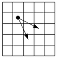

# Демоническое программирование

## A. Кузнечик

| Ограничения                                   |
|:---------------------------------------------:|
| ограничение по времени на тест: 2 секунды     |
| ограничение по памяти на тест: 256 мегабайт   |
| ввод: input.txt                               |
| вывод: output.txt                             |

### Условие

Кузнечик прыгает по столбикам, расположенным на одной линии на равных расстояниях друг от друга. Столбики имеют порядковые номера от $1$ до $N$. В начале Кузнечик сидит на столбике с номером 1. Он может прыгнуть на следующий столбик или сразу на второй столбик, считая от текущего. Требуется найти количество способов, которыми Кузнечик может добраться до столбика с номером $N$. Учитывайте, что Кузнечик не может прыгать назад.

### Входные данные

Входная строка содержит натуральное число $N$ $(1 \leqslant N \leqslant 45)$.

### Выходные данные

Программа должна вывести одно число: количество способов, которыми Кузнечик может добраться до столбика с номером $N$.

### Примеры

**входные данные**:

```bash
3
```

**выходные данные**:

```bash
2
```

**входные данные**:

```bash
4
```

**выходные данные**:

```bash
3
```

**входные данные**:

```bash
45
```

**выходные данные**:

```bash
1134903170
```

## B. Кузнечик собирает монеты

| Ограничения                                   |
|:---------------------------------------------:|
| ограничение по времени на тест: 2 секунды     |
| ограничение по памяти на тест: 256 мегабайт   |
| ввод: input.txt                               |
| вывод: output.txt                             |

### Условие

Кузнечик прыгает по столбикам, расположенным на одной линии на равных расстояниях друг от друга. Столбики имеют порядковые номера от $1$ до $N$. В начале Кузнечик сидит на столбике с номером $1$ и хочет добраться до столбика с номером $N$. Он может прыгнуть вперед на расстояние от $1$ до $K$ столбиков, считая от текущего.

На каждом столбике Кузнечик может получить или потерять несколько золотых монет (для каждого столбика это число известно). Определите, как нужно прыгать Кузнечику, чтобы собрать наибольшее количество золотых монет. Учитывайте, что Кузнечик не может прыгать назад.

### Входные данные

В первой строке вводятся два натуральных числа: $N$ и $K$ $(2 \leqslant N, K \leqslant 10000)$, разделённые пробелом. Во второй строке записаны через пробел $N - 2$ целых числа – количество монет, которое Кузнечик получает на каждом столбике, от $2$-го до $N - 1$-го. Если это число отрицательное, Кузнечик теряет монеты. Гарантируется, что все числа по модулю не превосходят $10000$.

### Выходные данные

В первой строке программа должна вывести наибольшее количество монет, которое может собрать Кузнечик. Во второй строке выводится число прыжков Кузнечика, а в третьей строке – номера всех столбиков, которые посетил Кузнечик (через пробел в порядке возрастания).

Если правильных ответов несколько, выведите любой из них.

### Примеры

**входные данные**:

```bash
5 3
2 -3 5
```

**выходные данные**:

```bash
7
3
1 2 4 5
```

## C. Последовательность из 0 и 1

| Ограничения                                   |
|:---------------------------------------------:|
| ограничение по времени на тест: 2 секунды     |
| ограничение по памяти на тест: 256 мегабайт   |
| ввод: input.txt                               |
| вывод: output.txt                             |

### Условие

Требуется подсчитать количество последовательностей длины $N$, состоящих из $0$ и $1$, в которых никакие две единицы не стоят рядом.

### Входные данные

На вход программы поступает целое число $N$ $(1 \leqslant N \leqslant 100)$.

### Выходные данные

Выведите количество искомых последовательностей.

### Примеры

**входные данные**:

```bash
1
```

**выходные данные**:

```bash
2
```

**входные данные**:

```bash
50
```

**выходные данные**:

```bash
32951280099
```

## D. Черепаха и монеты

| Ограничения                                   |
|:---------------------------------------------:|
| ограничение по времени на тест: 2 секунды     |
| ограничение по памяти на тест: 256 мегабайт   |
| ввод: input.txt                               |
| вывод: output.txt                             |

### Условие

Черепаха хочет переползти из левого верхнего угла поля размером $N$ на $M$ $(2 \leqslant N, M \leqslant 1000)$ в правый нижний. За один шаг она может переместиться на соседнюю клетку вправо или на соседнюю клетку вниз. Кроме того, проходя через каждую клетку, Черепаха получает (или теряет) несколько золотых монет (это число известно для каждой клетки).

Определите, какое максимальное количество монет может собрать Черепаха по пути и как ей нужно идти для этого.

### Входные данные

В первой строке вводятся два натуральных числа: $N$ и $M$ $(2 \leqslant N, M \leqslant 1000)$, разделённые пробелом. В каждой из следующих $N$ строк записаны через пробел по $M$ чисел $a_{ij}$ $(|a_{ij}| \leqslant 10)$, которые обозначают количество монет, получаемых Черепашкой при проходе через каждую клетку. Если это число отрицательное, Черепашка теряет монеты.

### Выходные данные

В первой строке программа должна вывести наибольшее количество монет, которое может собрать Черепаха. Во второй строке без пробелов выводятся команды, которые нужно выполнить Черепахе: буква `R` (от слова _right_) обозначает шаг вправо, а буква `D` (от слова
_down_) – шаг вниз.

### Примеры

**входные данные**:

```bash
3 3
0 2 -3
2 -5 7
1 2 0
```

**выходные данные**:

```bash
6
RRDD
```

## E. Числа фиксированной суммы

| Ограничения                                   |
|:---------------------------------------------:|
| ограничение по времени на тест: 2 секунды     |
| ограничение по памяти на тест: 256 мегабайт   |
| ввод: стандартный ввод                        |
| вывод: стандартный вывод                      |

### Условие

Сколько существует $K$-значных чисел с суммой цифр равной $S$? Числа берутся в десятичной системе счисления. Ведущие нули допустимы.

### Входные данные

$K$ $(1 \leqslant K \leqslant 1000)$ и $S$ $(0 \leqslant S \leqslant 9 \cdot K)$.

### Выходные данные

Количество таких чисел, посчитанное по модулю $10^{9} + 7$.

### Примеры

**входные данные**:

```bash
3 10
```

**выходные данные**:

```bash
63
```

## F. Лошадью ходи

| Ограничения                                   |
|:---------------------------------------------:|
| ограничение по времени на тест: 0.5 секунд    |
| ограничение по памяти на тест: 256 мегабайт   |
| ввод: knight.in                               |
| вывод: knight.out                             |

### Условие

В левом верхнем углу прямоугольной доски $N \times M$ находится шахматный конь. Перемещаться по доске он может только двумя способами: на две клетки вправо и на одну вниз, либо на две клетки вниз и на одну вправо.



Ваша задача состоит в том, чтобы посчитать количество способов, которыми конь может попасть в правую нижнюю клетку.

### Входные данные

В единственной строчке находятся два числа $N$ и $M$ $(1 \leqslant N, M \leqslant 50)$ — размеры доски.

### Выходные данные

Нужно вывести одно число — количество различных способов переместиться коню из левой верхней в правую нижнюю клетку.

### Примеры

**входные данные**:

```bash
4 4
```

**выходные данные**:

```bash
2
```

## G. Лошадью ходи - 2

| Ограничения                                   |
|:---------------------------------------------:|
| ограничение по времени на тест: 1 секунда     |
| ограничение по памяти на тест: 256 мегабайт   |
| ввод: knight.in                               |
| вывод: knight.out                             |

### Условие

Шахматный конь должен пройти по клетчатой доске размером $N$ на $M$ клеток из левого верхнего угла в правый нижний. Из каждой клетки
есть четыре возможных хода:


Определите, сколькими способами конь может пройти этот маршрут. Поскольку это число может быть очень велико, вычислите его по
модулю $10^{6} + 7$, то есть найдите остаток от деления этого числа на $10^{6} + 7$.

### Входные данные

Входная строка содержит два натуральных числа: размеры доски $N$ и $M$ $(1 \leqslant N, M \leqslant 500)$.

### Выходные данные

Программа должна вывести число возможных маршрутов шахматного коня из левого верхнего угла поля в правый нижний, вычисленное
по модулю $10^{6} + 7$.

### Примеры

**входные данные**:

```bash
5 5
```

**выходные данные**:

```bash
4
```

## H. Расстояние по Левенштейну

| Ограничения                                   |
|:---------------------------------------------:|
| ограничение по времени на тест: 2 секунды     |
| ограничение по памяти на тест: 256 мегабайт   |
| ввод: стандартный ввод                        |
| вывод: стандартный вывод                      |

### Условие

Дана текстовая строка. С ней можно выполнять следующие операции:

* Заменить один символ строки на другой символ.
* Удалить один произвольный символ.
* Вставить произвольный символ в произвольное место строки.

Например, при помощи первой операции из строки «СОК» можно получить строку «СУК», при помощи второй операции — строку «ОК», при помощи третьей операции — строку «СТОК».

Минимальное количество таких операций, при помощи которых можно из одной строки получить другую, называется стоимостью редактирования или расстоянием Левенштейна.

Определите расстояние Левенштейна для двух данных строк.

### Входные данные

Программа получает на вход две строки, длина каждой из которых не превосходит $1000$ символов, строки состоят только из заглавных латинских букв.

### Выходные данные

Требуется вывести одно число — расстояние Левенштейна для данных строк.

### Примеры

**входные данные**:

```bash
ABCDEFGH
ACDEXGIH
```

**выходные данные**:

```bash
3
```

## I. Кафе

| Ограничения                                   |
|:---------------------------------------------:|
| ограничение по времени на тест: 2 секунды     |
| ограничение по памяти на тест: 64 мегабайта   |
| ввод: стандартный ввод                        |
| вывод: стандартный вывод                      |

### Условие

Около Петиного университета недавно открылось новое кафе, в котором действует следующая система скидок: при каждой покупке более чем на $100$ рублей покупатель получает купон, дающий право на один бесплатный обед (при покупке на сумму $100$ рублей и меньше такой купон покупатель не получает).

Однажды Пете на глаза попался прейскурант на ближайшие $n$ дней. Внимательно его изучив, он решил, что будет обедать в этом кафе все $n$ дней, причем каждый день он будет покупать в кафе ровно один обед. Однако стипендия у Пети небольшая, и поэтому он хочет по максимуму использовать предоставляемую систему скидок так, чтобы его суммарные затраты были минимальны. Требуется найти минимально возможную суммарную стоимость обедов и номера дней, в которые Пете следует воспользоваться купонами.

### Входные данные

В первой строке входного файла записано целое число $n$ $(0 \leqslant n \leqslant 100)$. В каждой из последующих n строк записано одно целое число, обозначающее стоимость обеда в рублях на соответствующий день. Стоимость — неотрицательное целое число, не превосходящее $300$.

### Выходные данные

В первой строке выдайте минимальную возможную суммарную стоимость обедов. Во второй строке выдайте два числа $k_{1}$ и $k_{2}$ — количество купонов, которые останутся неиспользованными у Пети после этих n дней и количество использованных им купонов соответственно.

В последующих $k_{2}$ строках выдайте в возрастающем порядке номера дней, когда Пете следует воспользоваться купонами. Если существует несколько решений с минимальной суммарной стоимостью, то выдайте то из них, в котором значение $k_{1}$ максимально (на случай, если Петя когда-нибудь ещё решит заглянуть в это кафе). Если таких решений несколько, выведите любое из них.

### Примеры

**входные данные**:

```bash
5
110
40
120
110
60
```

**выходные данные**:

```bash
260
0 2
3
5
```

**входные данные**:

```bash
3
110
110
110
```

**выходные данные**:

```bash
220
1 1
2
```

## J. Строй штурмовиков

| Ограничения                                   |
|:---------------------------------------------:|
| ограничение по времени на тест: 2 секунды     |
| ограничение по памяти на тест: 256 мегабайт   |
| ввод: стандартный ввод                        |
| вывод: стандартный вывод                      |

### Условие

На планете Татуин снова проходит сражение между армией штурмовиков и повстанцев. Армия штурмовиков представляет из себя укоплектованный строй из $N \times M$ солдат. После продолжительной битвы многие солдаты пали и войска штурмовиков поредели. Максимилиан Вирс всегда отличался умением вести битвы, и на этот раз у него есть разрушительная стратегия, но для ее исполнения ему
необходимо узнать обстановку в его войске.

Он отправляет одного из коммандеров штурмовиков сесть на гравицикл и пролететь надо войском для его оценки. Если точнее, ему необходимо знать, какой максимальный квадрат его армии остался уцелевшим. Коммандер видит строй и может сказать о том, в какой точке присутсвует штурмовик, а в какой — уже пал. Помогите коммандеру найти длину такого максимального квадрата, где войско осталось целым по данным, которые он вам предоставит.

### Входные данные

В первой строке даны два натуральных числа $N$ и $M$ $(1 \leqslant N, M \leqslant 1000)$. Далее в $N$ строках расположено по $M$ чисел, разделенных пробелами (число равно $0$, если в позиции отсутствует штурмовик, или $1$, если уцелел).

### Выходные данные

Выведите одно число — сторону максимального квадрата, полностью состоящего из уцелевших штурмовиков.

### Примеры

**входные данные**:

```bash
4 5
0 0 0 1 0
0 1 1 1 0
0 0 1 1 0
1 0 1 0 0
```

**выходные данные**:

```bash
2
```

## K. Наибольшая возрастающая подпоследовательность

| Ограничения                                   |
|:---------------------------------------------:|
| ограничение по времени на тест: 2 секунды     |
| ограничение по памяти на тест: 256 мегабайт   |
| ввод: стандартный ввод                        |
| вывод: стандартный вывод                      |

### Условие

Пусть $a_{1}, a_{2}, \ldots, a_{n}$ — числовая последовательность. Длина последовательности — это количество элементов этой последовательности. Последовательность $a_{i_{1}}, a_{i_{2}}, \ldots, a_{i_{k}}$ называется подпоследовательностью последовательности $a$, если $1 \leqslant i_{1} < i_{2} < \ldots < i_{k} \leqslant n$. Последовательность $a$ называется возрастающей, если $a_{1} < a_{2} < \ldots < a_{n}$.

Вам дана последовательность, содержащая n целых чисел. Найдите ее самую длинную возрастающую подпоследовательность.

### Входные данные

В первой строке задано одно число $n$ $(1 \leqslant n \leqslant 2000)$ — длина подпоследовательности. В следующей строке задано $n$ целых чисел $a_{i}$ $(-10^{9} \leqslant a_{i} \leqslant 10^{9}$ — элементы последовательности.

### Выходные данные

В первой строке выведите число $k$ — длину наибольшей возрастающей подпоследовательности. В следующей строке выведите $k$ чисел — саму подпоследовательность.

### Примеры

**входные данные**:

```bash
5
1 3 5 4 2
```

**выходные данные**:

```bash
3
1 3 5
```

**входные данные**:

```bash
3
1 2 3
```

**выходные данные**:

```bash
3
1 2 3
```

## L. Большая наибольшая возрастающая подпоследовательность

| Ограничения                                   |
|:---------------------------------------------:|
| ограничение по времени на тест: 2 секунды     |
| ограничение по памяти на тест: 256 мегабайт   |
| ввод: стандартный ввод                        |
| вывод: стандартный вывод                      |

### Условие

Числовая последовательность задана рекуррентной формулой: $a_{i + 1} = (k \cdot a_{i} + b) \mod m$. Найдите её наибольшую возрастающую подпоследовательность.

### Входные данные

Программа получает на вход пять целых чисел: длину последовательности $n$ $(1 \leqslant n \leqslant 10^{5})$, начальный элемент последовательности $a_{1}$, параметры $k$, $b$, $m$ для вычисления последующих членов последовательности $(1 \leqslant m \leqslant 10^{5}, 0 \leqslant k < m, 0 \leqslant b < m, 0 \leqslant a_{1} < m)$.

### Выходные данные

Требуется вывести длину наибольшей возрастающей подпоследовательности.

### Примеры

**входные данные**:

```bash
5 41 2 1 100
```

**выходные данные**:

```bash
3
```

#### Примечание

В данном примере последовательность состоит из 5 элементов: $a_{1} = 41$, $a_{i + 1} = (2 \cdot a_{i} + 1) \mod 100$, то есть последовательность имеет вид $41, 83, 67, 35, 71$.

## M. Задача о рюкзаке: точный вес, без ответа

| Ограничения                                   |
|:---------------------------------------------:|
| ограничение по времени на тест: 2 секунды     |
| ограничение по памяти на тест: 512 мегабайт   |
| ввод: стандартный ввод                        |
| вывод: стандартный вывод                      |

### Условие

Дано $n$ золотых слитков массой $w_{1}, \ldots, w_{n}$. Ими наполняют рюкзак, который выдерживает вес не более $s$. Можно ли набрать вес в точности $s$?

### Входные данные

В первой строке вводится натуральное число $n$, не превышающее $100$ и натуральное число $s$, не превышающее $10000$.

Во второй строке вводятся $n$ натуральных чисел $w_{i}$, не превышающих $100$.

### Выходные данные

Выведите `YES` или `NO`.

### Примеры

**входные данные**:

```bash
4 102
50 52 54 2
```

**выходные данные**:

```bash
YES
```

**входные данные**:

```bash
2 3195
38 41
```

**выходные данные**:

```bash
NO
```

## N. Задача о рюкзаке: наибольший вес, с ответом

| Ограничения                                   |
|:---------------------------------------------:|
| ограничение по времени на тест: 2 секунды     |
| ограничение по памяти на тест: 512 мегабайт   |
| ввод: стандартный ввод                        |
| вывод: стандартный вывод                      |

### Условие

Дано $n$ золотых слитков массой $w_{1}, \ldots, w_{n}$. Ими наполняют рюкзак, который выдерживает вес не более $s$. Какую наибольшую массу золота можно унести в таком рюкзаке?

### Входные данные

В первой строке вводится натуральное число $n$, не превышающее $100$ и натуральное число $s$, не превышающее $10000$.

Во второй строке вводятся $n$ натуральных чисел $w_{i}$, не превышающих $100$.

### Выходные данные

Выведите в первой строке одно целое число — наибольшую возможную массу золота, которую можно унести в данном рюкзаке. Во второй строке выведите число слитков, которое нужно взять, а в третьей строке — веса слитков, которые нужно взять. Если ответов несколько, выведите любой.

### Примеры

**входные данные**:

```bash
5 47
42 52 38 67 10
```

**выходные данные**:

```bash
42
1
42
```

**входные данные**:

```bash
4 8
2 3 4 7
```

**выходные данные**:

```bash
7
2
4 3
```

## O. Задача о рюкзаке

| Ограничения                                   |
|:---------------------------------------------:|
| ограничение по времени на тест: 2 секунды     |
| ограничение по памяти на тест: 512 мегабайт   |
| ввод: стандартный ввод                        |
| вывод: стандартный вывод                      |

### Условие

Дано $n$ предметов массой $w_{1}, \ldots, w_{n}$.

Ими наполняют рюкзак, который выдерживает вес не более $s$. Как набрать вес в точности $s$, используя как можно меньше предметов?

### Входные данные

В первой строке вводится натуральное число $n$, не превышающее $100$ и натуральное число $s$, не превышающее $10000$.

Во второй строке вводятся $n$ натуральных чисел $w_{i}$, не превышающих $100$.

### Выходные данные

Выведите наименьшее необходимое число предметов или $0$, если набрать данный вес невозможно.

### Примеры

**входные данные**:

```bash
4 6
4 2 3 1
```

**выходные данные**:

```bash
2
```
