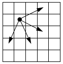

# [G. Лошадью ходи - 2](G.java)

| Ограничения                                 |
|:-------------------------------------------:|
| ограничение по времени на тест: 1 секунда   |
| ограничение по памяти на тест: 256 мегабайт |
| входной файл: `knight.in`                   |
| выходной файл: `knight.out`                 |

## Условие

Шахматный конь должен пройти по клетчатой доске размером $N$ на $M$ клеток из левого верхнего угла в правый нижний. Из каждой клетки
есть четыре возможных хода:



Определите, сколькими способами конь может пройти этот маршрут. Поскольку это число может быть очень велико, вычислите его по
модулю $10^{6} + 7$, то есть найдите остаток от деления этого числа на $10^{6} + 7$.

## Входные данные

Входная строка содержит два натуральных числа: размеры доски $N$ и $M$ $(1 \leqslant N, M \leqslant 500)$.

## Выходные данные

Программа должна вывести число возможных маршрутов шахматного коня из левого верхнего угла поля в правый нижний, вычисленное
по модулю $10^{6} + 7$.

## Примеры

**входные данные**:

```text
5 5
```

**выходные данные**:

```text
4
```
