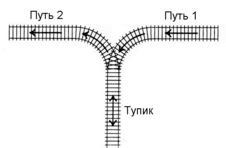

# [I. Сортировка вагонов](I.cpp)

| Ограничения                                 |
|:-------------------------------------------:|
| ограничение по времени на тест: 2 секунды   |
| ограничение по памяти на тест: 256 мегабайт |
| входной файл: `стандартный ввод`            |
| выходной файл: `стандартный вывод`          |

## Условие

К тупику со стороны пути $1$ (см. рисунок) подъехал поезд. Разрешается отцепить от поезда один или сразу несколько первых вагонов и завезти их в тупик (при желании, можно даже завезти в тупик сразу весь поезд). После этого часть из этих вагонов вывезти в сторону пути $2$. После этого можно завезти в тупик еще несколько вагонов и снова часть оказавшихся вагонов вывезти в сторону пути $2$. И так далее (так, что каждый вагон может лишь один раз заехать с пути $1$ в тупик, а затем один раз выехать из тупика на путь $2$). Заезжать в тупик с пути $2$ или выезжать из тупика на путь $1$ запрещается. Нельзя с пути $1$ попасть на путь $2$, не заезжая в тупик.



Известно, в каком порядке изначально идут вагоны поезда. Требуется с помощью указанных операций сделать так, чтобы вагоны поезда шли по порядку (сначала первый, потом второй и т. д., считая от головы поезда, едущего по пути $2$ в сторону от тупика).

## Входные данные

Вводится число $N$ — количество вагонов в поезде $(1 \leqslant N \leqslant 2000)$. Дальше идут номера вагонов в порядке от головы поезда, едущего по пути 1 в сторону тупика. Вагоны пронумерованы натуральными числами от $1$ до $N$, каждое из которых встречается ровно один раз.

## Выходные данные

Если сделать так, чтобы вагоны шли в порядке от $1$ до $N$, считая от головы поезда, когда поезд поедет по пути 2 из тупика, можно, выведите действия, которые нужно проделать с поездом. Каждое действие описывается двумя числами: типом и количеством вагонов:

* если нужно завезти с пути $1$ в тупик $K$ вагонов, должно быть выведено сначала число $1$, а затем — число $K$ $(K \geqslant 1)$,
* если нужно вывезти из тупика на путь $2$ $K$ вагонов, должно быть выведено сначала число $2$, а затем — число $K$ $(K \geqslant 1)$.

Если возможно несколько последовательностей действий, приводящих к нужному результату, выведите любую из них.

Если выстроить вагоны по порядку невозможно, выведите одно число $0$.

## Примеры

**входные данные**:

```text
3
3 2 1
```

**выходные данные**:

```text
1 1
1 1
1 1
2 1
2 1
2 1
```

**входные данные**:

```text
4
4 1 3 2
```

**выходные данные**:

```text
1 1
1 1
2 1
1 1
1 1
2 1
2 1
2 1
```

**входные данные**:

```text
3
2 3 1
```

**выходные данные**:

```text
0
```
